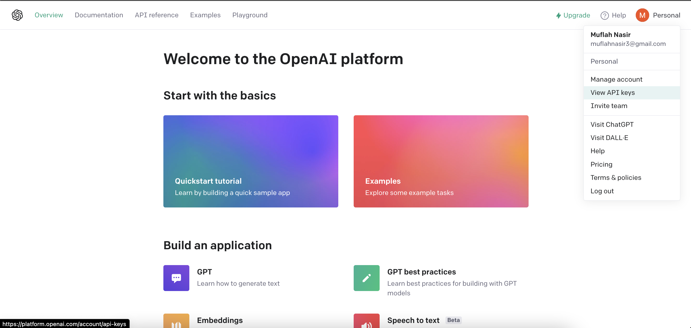

# StrattonGPT

This is a test repo.

We are using `OpenAi` because they provide best APIs and models to integrate AI into react. The purpose of this repo is to test how we can generate content for any online learning application. We will provide commands to our AI and in return we will get content as a result. And are also able to generate pop quizes for our courses.

In order to be able to interact with AI we first need to connect our project with `OpenAi` to get API key.

## Steps to get API key from OpenAi.

1. Go to https://openai.com/.
2. Sign In/Sign up yourself.
3. Go To `API`.
4. Go to `View API keys`.

   

5. Create A Secret key. 
6. Copy that key

## Add API key into your project

1. Creat `.env` file and paste your API key in that env file with name `REACT_APP_API_KEY`.

Explore the project and test by generating as much content and pop quizes as you want.

Good Luck!!
